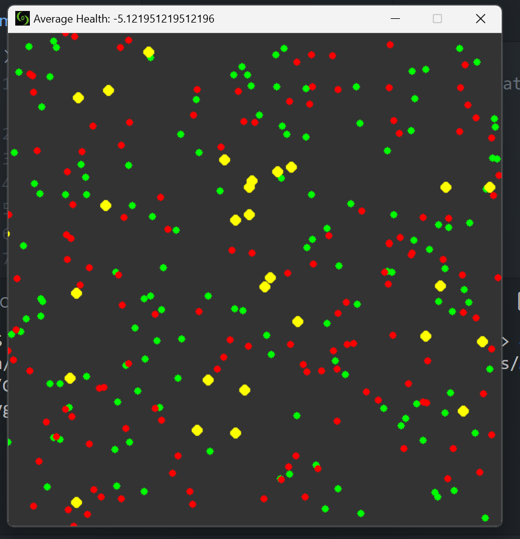
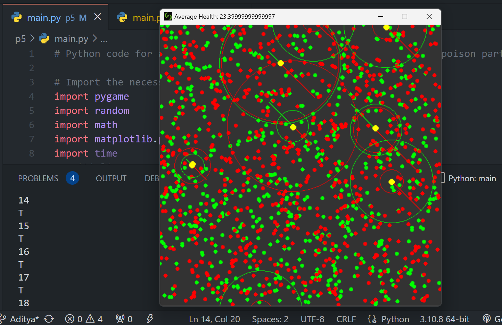
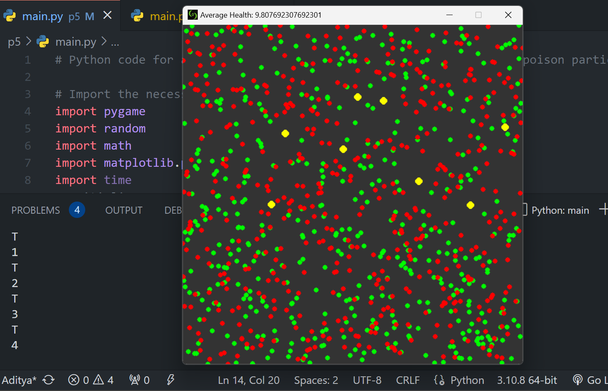
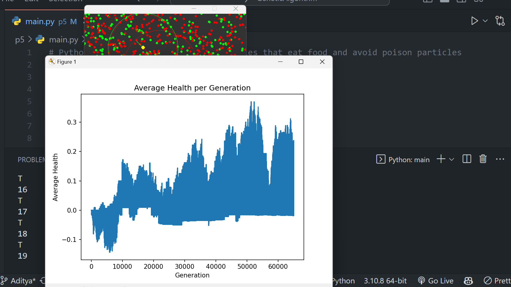

# Vehicle Simulation

Under Guidance of College Coding Club CoC.
<strong>

This is a Python simulation of vehicles that eat food and avoid poison particles. 
The simulation is built using the Pygame library, which is a set of Python modules designed for writing video games. 
The simulation is displayed on a screen with a width of 1080 pixels and a height of 720 pixels. 

    

### <strong style="font-family:courier new">
Basic interface
<strong>
The simulation includes vehicles, food particles, and poison particles. 
The vehicles are controlled by a set of rules that determine their behavior, such as seeking out food particles and avoiding poison particles.

    

### <strong style="font-family:copperplate gothic">
Vehicle with debug mode on
<strong>

# Genetic Algorithm
DNA List contains 4 genes for each vehicle
1. Food Attractions
2. Poison Repulsions
3. Food Perception
4. Poison Perception

It works by creating a new population of vehicles based on the fitness of the previous population.
The fitness of each vehicle is determined by the amount of food it eats and the amount of poison it avoids.
The vehicles with the highest fitness are more likely to be selected for reproduction.

    

### <strong style="font-style:italic">
Generations of vehicles
<strong>
The vehicles with the lowest fitness are less likely to be selected for reproduction.
The vehicles with the highest fitness are more likely to pass on their genes to the next generation.
The vehicles with the lowest fitness are less likely to pass on their genes to the next generation.
The vehicles with the highest fitness are more likely to have their genes mutated.

    
    

### <strong style="font-family:courier new">
Graph showing average health of vehicles over generations
Graph made using Matplotlib
<strong>

## Usage

To run the simulation, simply run the `main.py` file using Python. The simulation will start and run until the user quits the simulation.

## Dependencies

- Python 3
- Pygame

## Installation

1. Install Python 3 from the official website: https://www.python.org/downloads/
2. Install Pygame by running the following command in the terminal: `pip install pygame`
3. Download the `main.py` file from this repository
4. Run the `main.py` file using Python

## License

This code is licensed under the MIT License. See the `LICENSE` file for more information.

## Pygame Library

The Pygame library is used extensively in the simulation to handle the graphics and user input. Here are some of the ways that Pygame is used:

1. The Pygame library is used to create a window with a width of 1080 pixels and a height of 720 pixels. This window is used to display the simulation.

2. Pygame is used to handle user input, such as quitting the simulation or toggling debug mode.

3. Pygame is used to draw the vehicles, food particles, and poison particles on the screen. This is done using the Pygame draw functions, such as `draw.circle()` and `draw.line()`.

4. Pygame is used to handle the frame rate of the simulation. The frame rate is set to 15 frames per second using the Pygame `time.Clock()` function.

5. Pygame is used to handle the event loop of the simulation. This loop handles events such as quitting the simulation, toggling debug mode, and adding a new vehicle.

Overall, Pygame is an essential part of the simulation, as it provides the necessary tools for handling graphics and user input. Without Pygame, it would be much more difficult to create a simulation with a graphical interface.